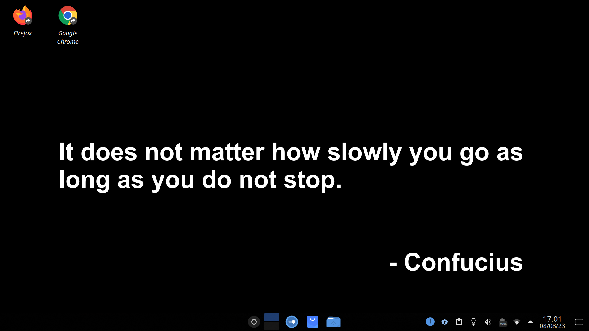

# quwallpaper

A command line interface to generate motivational quote as desktop wallpaper.

<p align="center">
  
</p>

<!-- toc -->

- [quwallpaper](#quwallpaper)
- [Usage](#usage)
- [Commands](#commands)
  - [`quwallpaper generate`](#quwallpaper-generate)
  - [`quwallpaper help [COMMANDS]`](#quwallpaper-help-commands)
- [Tested On](#tested-on)
- [Related](#related)

# Usage

<!-- usage -->

```sh-session
$ cd quwallpaper
$ npm install
$ npm run build
$ npm install -g
$ quwallpaper COMMAND
running command...
$ quwallpaper (--version)
quwallpaper/1.0.0 linux-x64 node-v18.15.0
$ quwallpaper --help [COMMAND]
USAGE
  $ quwallpaper COMMAND
...
```

<!-- usagestop -->

# Commands

<!-- commands -->

- [quwallpaper](#quwallpaper)
- [Usage](#usage)
- [Commands](#commands)
  - [`quwallpaper generate`](#quwallpaper-generate)
  - [`quwallpaper help [COMMANDS]`](#quwallpaper-help-commands)
- [Tested On](#tested-on)
- [Related](#related)

## `quwallpaper generate`

Generate image with quote in it and set your desktop background with the image

```
USAGE
  $ quwallpaper generate [-w <value>] [-h <value>] [-s <value>] [-o <value>] [-f <value>] [-c <value>] [-b
    <value>]

FLAGS
  -b, --background-color=<value>  [default: #000] Background color (hex) of the generated image.
  -c, --color=<value>             [default: #fff] Font color (hex) of the quotes and author name.
  -f, --font-family=<value>       [default: Arial] Font family of quotes and author name.
  -h, --height=<value>            [default: 1080] Image's height to generate. Set it to be same as your desktop height
                                  resolution.
  -o, --output=<value>            [default: ./quotes] Output folder to store generated image.
  -s, --font-size=<value>         [default: 60] Font size (pt) of the quote and author name.
  -w, --width=<value>             [default: 1920] Image's width to generate. Set it to be same as your desktop width
                                  resolution.

DESCRIPTION
  Generate image with quote in it and set your desktop background with the image

EXAMPLES
  $ quwallpaper generate
```

## `quwallpaper help [COMMANDS]`

Display help for quwallpaper.

```
USAGE
  $ quwallpaper help [COMMANDS] [-n]

ARGUMENTS
  COMMANDS  Command to show help for.

FLAGS
  -n, --nested-commands  Include all nested commands in the output.

DESCRIPTION
  Display help for quwallpaper.
```

<!-- commandsstop -->

# Tested On

- Node JS version 18 or above
- Windows 10/11
- Fedora Linux 37 (KDE)

# Related

- [Quoteable](https://github.com/lukePeavey/quotable) - API used to fetch random quote
